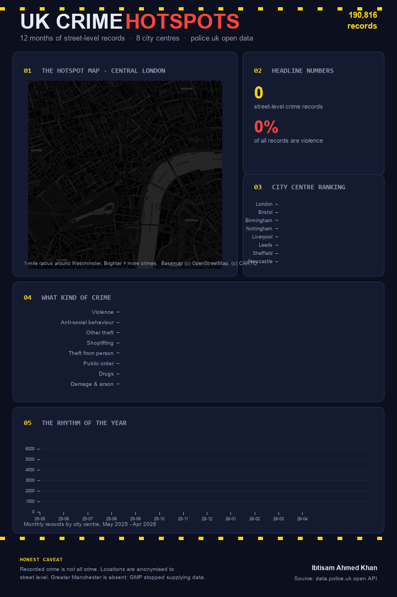

# UK Crime Hotspots: One Animated Poster

**190,816 real street-level crime records** pulled from the police.uk open API: 12 months (May 2025 - April 2026) across 8 UK city centres, each a 1-mile radius around the centre point.

The output format is the point: instead of a deck of separate charts, everything lives on **one vertical infographic poster that builds itself** - hotspot map, headline numbers, city ranking, crime mix, and seasonality, animating in panel by panel on a single dark forensic-themed canvas.

## The poster



An MP4 version is included for platforms that freeze GIFs (LinkedIn does).

## Key findings

| Finding | Numbers |
|---|---|
| Violence dominates recorded crime | 45,572 records (24% of everything) - the largest single category |
| London's volume is its own league | 62,808 records in one square mile of Westminster vs 13-22k for every other city centre |
| Crime has a season | Records peak in November-December and trough in late winter |
| Retail crime is enormous | Shoplifting (22,053) + other theft (23,499) + theft from person (20,938) together outweigh violence |
| The single busiest location type | "On or near Nightclub" - 6,049 records in central London alone |

## Honest limitations

- **Recorded crime is not all crime.** Reporting rates vary by offence and by area; anti-social behaviour especially depends on local policing practice.
- Locations are anonymised by police.uk to the nearest of ~750,000 snap points, so the map shows street-level patterns, not exact addresses.
- **Greater Manchester is absent** - GMP has not supplied data to police.uk since 2019. Choosing cities required checking coverage first, which is itself a lesson in working with public data.
- City "centres" are 1-mile API radii around a chosen point; results are sensitive to where the pin drops.

## What's in the analysis

1. Polite, rate-limited ingestion from a public REST API (96 calls, retry logic)
2. Hexbin density mapping of 62k London records with log-scaled colour over CartoDB dark basemap tiles (Web Mercator projection)
3. Cross-city comparison, category mix, and 12-month seasonality
4. A 36-frame self-building infographic rendered entirely in matplotlib (panel cards, hazard stripes, eased animations) and exported with imageio

## Repository structure

```
fetch_data.py        # police.uk API ingestion (12 months x 8 cities)
build_poster.py      # one-poster animated infographic pipeline
data/                # 190,816 street-level records (CSV)
charts/              # static poster (PNG)
gifs/                # animated poster (GIF + MP4)
linkedin-post.txt    # ready-to-publish post copy
```

Run: `pip install pandas numpy matplotlib imageio imageio-ffmpeg contextily`, then `python fetch_data.py` and `python build_poster.py`.

**Data source:** data.police.uk open API. Contains public sector information licensed under the Open Government Licence v3.0. Basemap tiles (c) OpenStreetMap contributors, (c) CARTO.

*Author: Ibtisam Ahmed Khan - [linkedin.com/in/ibtisam-ahmed-khan](https://linkedin.com/in/ibtisam-ahmed-khan)*
